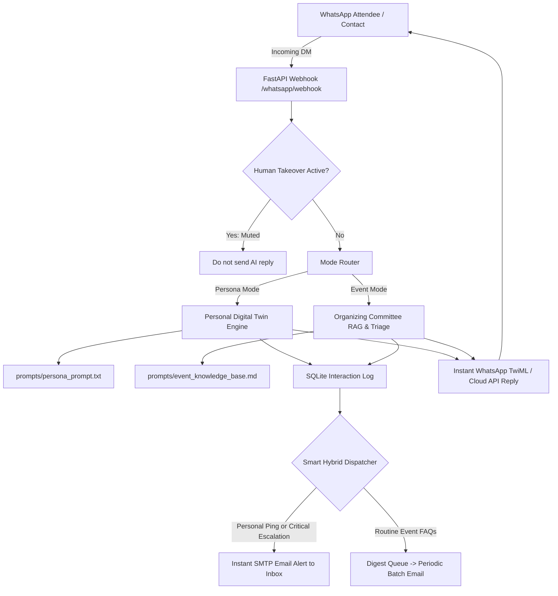

# 🤖 PersonaTwin & EventDesk: WhatsApp AI Agent

An autonomous WhatsApp AI agent engineered with dual operational modes:
1. **Personal Digital Twin Mode**: Mimics your personal tone, vocabulary, and communication style to respond to contacts on WhatsApp whenever you are unavailable (e.g. asleep, traveling, or in meetings). Every time someone pings or leaves a message, an instant notification email is delivered directly to your inbox with a 1-click WhatsApp link.
2. **Organizing Committee Mode (Event Helpdesk)**: Scalable triage engine designed to handle **$N$ concurrent participant DMs** during hackathons, conferences, and fests. Automatically resolves FAQs (schedule, Wi-Fi, food, submissions) using a local Knowledge Base, categorizes inquiries, and triggers high-priority email alerts for critical medical or logistics escalations.

---

## 🌟 Key Capabilities

- **WhatsApp Integration**: Native **Green API** integration (webhook receiver + automated responses) + Twilio WhatsApp Webhook + Meta WhatsApp Cloud API.
- **Smart Hybrid Email Alerts**:
  - **Instant Alerts**: Dispatched immediately for personal pings and emergency event escalations (`[CRITICAL ESCALATION]`).
  - **Automated Batch Digest**: Summarizes routine event queries periodically (e.g. every 5–15 mins) to prevent inbox flooding during high-volume surges.
- **Human Takeover / Mute Control**: Mute the AI for specific conversations with one click whenever you take over chatting directly.
- **Local RAG & Categorization**: Tags queries into `REGISTRATION`, `SCHEDULE`, `LOGISTICS`, `SUBMISSION`, `SPONSORSHIP`, and `URGENT_ESCALATION`.
- **Built-in Web Command Center**: Live message feed, mode switcher, knowledge base viewer, and an instant browser sandbox to test without connecting WhatsApp.

---

## 🏗️ Architecture



---

## 🚀 Quickstart Guide

### 1. Activate Environment & Install Dependencies
Open PowerShell or your terminal in the project directory:

```powershell
cd c:\Users\Hp\Downloads\twin-event-agent
.\venv\Scripts\Activate.ps1
pip install -r requirements.txt
```

### 2. Configure Environment (`.env`)
Copy `.env.example` to `.env`:
```powershell
cp .env.example .env
```
Fill in the following details:
- **`GEMINI_API_KEY`**: Get a free API key from [Google AI Studio](https://aistudio.google.com/).
- **`AGENT_MODE`**: `"persona"` or `"event"` or `"auto"`.
- **`SMTP_USER`** & **`SMTP_PASSWORD`**: Your Gmail address and an [App Password](https://myaccount.google.com/apppasswords).
- **`NOTIFICATION_EMAIL_TO`**: Your primary email address where alerts should arrive.
- **`GREEN_API_INSTANCE_ID`** & **`GREEN_API_API_TOKEN_INSTANCE`**: From your [Green API Console](https://console.green-api.com/).
- **`TWILIO_ACCOUNT_SID`** & **`TWILIO_AUTH_TOKEN`**: (Optional: If using Twilio instead).

### 3. Run Self-Test Pipeline
Verify database creation, persona logic, event triage, and escalation detection:
```powershell
python test_simulation.py
```

### 4. Launch the Server & Command Center
```powershell
python -m uvicorn main:app --reload --host 127.0.0.1 --port 8000
```
Open **`http://127.0.0.1:8000`** in your browser to access the Web Command Center!

---

## 📱 Connecting to WhatsApp via Green API (Recommended)

1. Register or log in at [Green API](https://green-api.com/).
2. In your **Personal Cabinet**, create or open an instance.
3. Link WhatsApp by scanning the **QR code** using your WhatsApp mobile app (**Linked Devices**).
4. Copy your **`idInstance`** and **`apiTokenInstance`** from instance settings and set them in your `.env`:
   ```env
   WHATSAPP_PROVIDER=green_api
   GREEN_API_INSTANCE_ID=your_idInstance
   GREEN_API_API_TOKEN_INSTANCE=your_apiTokenInstance
   GREEN_API_HOST=https://api.green-api.com
   ```
5. Expose your local server to the web using [ngrok](https://ngrok.com/) or localtunnel:
   ```bash
   ngrok http 8000
   ```
6. In **Green API Instance Settings**:
   - Turn on **"Receive notifications about incoming messages and files"** (`incomingWebhook`).
   - Paste your webhook URL:
     ```
     https://<your-ngrok-subdomain>.ngrok-free.app/whatsapp/green-api-webhook
     ```
   *(Note: The `/whatsapp/webhook` endpoint also auto-detects Green API payloads!)*
7. Send a message to your WhatsApp number from any other phone! The agent will automatically reply and notify you via email.

---

## 📱 Alternative: Twilio WhatsApp Sandbox

If you prefer Twilio:
1. In `.env`, set `WHATSAPP_PROVIDER=twilio` and provide `TWILIO_ACCOUNT_SID`, `TWILIO_AUTH_TOKEN`, and `TWILIO_WHATSAPP_NUMBER`.
2. Expose your server using ngrok: `ngrok http 8000`
3. In Twilio Sandbox Settings, paste your webhook URL into **"WHEN A MESSAGE COMES IN"**:
   ```
   https://<your-ngrok-subdomain>.ngrok-free.app/whatsapp/webhook
   ```
   Set HTTP Method to **`HTTP POST`**.

---

## ✏️ Customization

- **Change Persona Tone**: Edit [`prompts/persona_prompt.txt`](file:///c:/Users/Hp/Downloads/twin-event-agent/prompts/persona_prompt.txt) to match your speaking style, slang, rules, and current availability status.
- **Update Event Knowledge Base**: Edit [`prompts/event_knowledge_base.md`](file:///c:/Users/Hp/Downloads/twin-event-agent/prompts/event_knowledge_base.md) with your event's exact schedules, Wi-Fi passwords, submission links, venue layout, and contact numbers.
